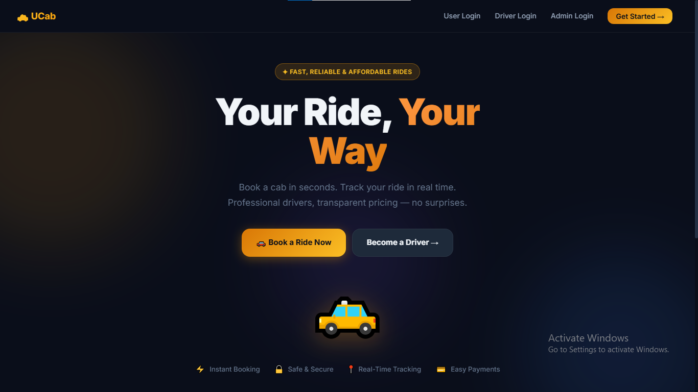
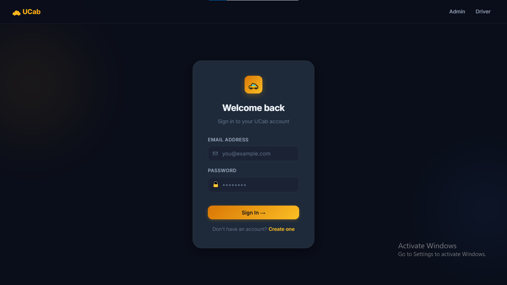
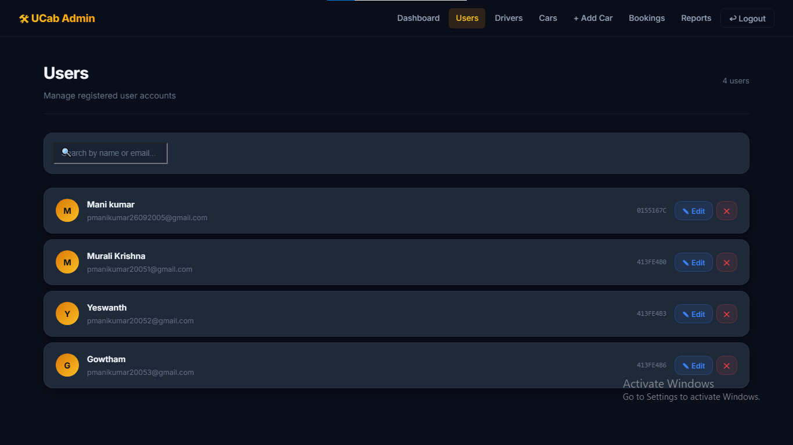
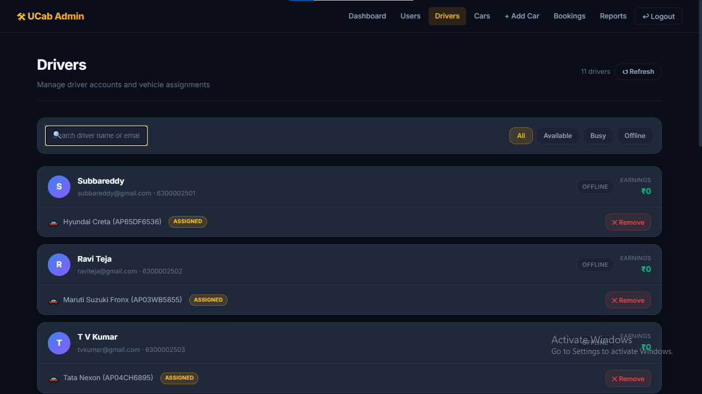
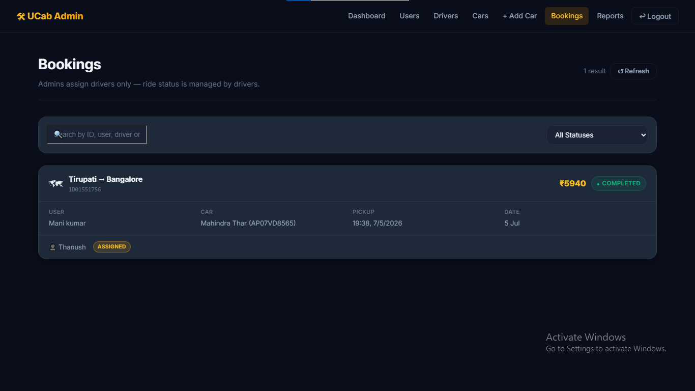
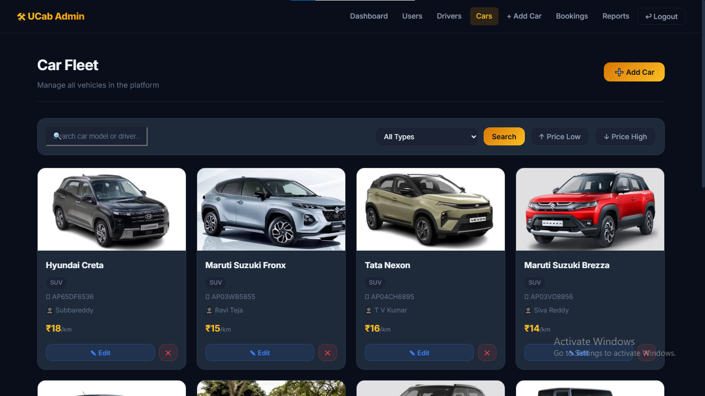

# 🚖 UCab Premium - MERN Cab Booking System

A full-stack MERN (MongoDB, Express.js, React.js, Node.js) Cab Booking application that provides separate dashboards for **Users**, **Drivers**, and **Administrators**.

---

## 📌 Project Overview

UCab Premium is an online cab booking platform where users can book rides, administrators can manage bookings, cars, and drivers, and drivers can accept, start, and complete assigned rides.

---

# ✨ Features

### 👤 User
- User Registration & Login
- Book a Cab
- View My Bookings
- Cancel Booking
- Download Booking Receipt
- Secure Authentication using JWT

### 🚖 Driver
- Driver Login
- View Assigned Rides
- Accept Ride
- Reject Ride
- Start Ride
- Complete Ride
- Earnings Dashboard

### 🛠 Admin
- Admin Login
- Dashboard
- Manage Users
- Manage Drivers
- Manage Cars
- Assign Driver
- Reassign Driver
- Cancel Booking
- View Reports

---

# 🛠 Tech Stack

## Frontend
- React.js
- Vite
- Axios
- React Router

## Backend
- Node.js
- Express.js

## Database
- MongoDB
- Mongoose

## Authentication
- JWT
- bcryptjs

---

# 📁 Project Structure

```
Cab-Booking-Premium
│
├── client
│   ├── src
│   ├── public
│   └── package.json
│
├── server
│   ├── controllers
│   ├── models
│   ├── routes
│   ├── middlewares
│   ├── config
│   └── server.js
│
├── screenshots
├── README.md
└── .gitignore
```

---

# ⚙ Installation

## Clone Repository

```bash
git clone https://github.com/manikumar26092005/Cab-Booking-Premium.git
```

## Install Frontend

```bash
cd client
npm install
npm run dev
```

## Install Backend

```bash
cd server
npm install
npm run dev
```

---

# Environment Variables

Create a `.env` file inside the **server** folder.

```
PORT=8000

MONGO_URI=YOUR_MONGODB_CONNECTION_STRING

JWT_SECRET=YOUR_SECRET_KEY

JWT_EXPIRES_IN=7d
```

---

# 📸 Screenshots

## Home Page



---

## Login Page



---

## Admin Dashboard



---

## Driver Dashboard



---

## Bookings



---

## Cars



---

# Future Enhancements

- Online Payment Integration
- Google Maps Integration
- Live Driver Tracking
- Ride Rating System
- Push Notifications
- Email Notifications
- Mobile Application

---

# Developed By

**Paidipati Manikumar**

Electronics and Communication Engineering (ECE)

Annamacharya Institute of Technology & Sciences, Tirupati

---

# License

This project is developed for educational purposes.